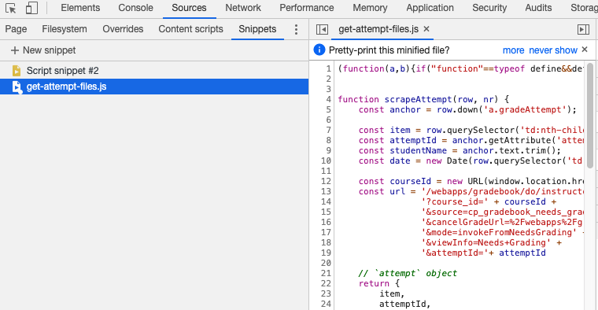
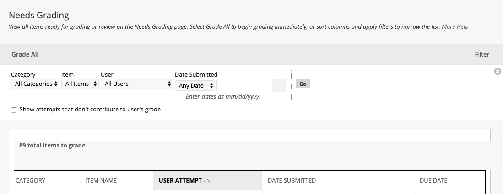
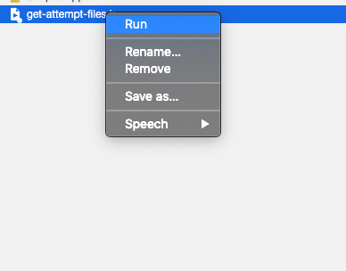
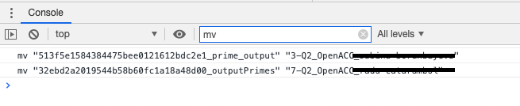
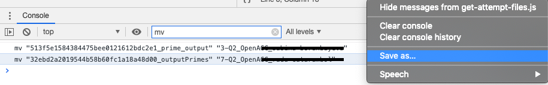
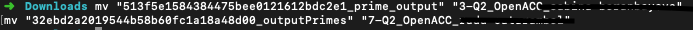

# Blackboard Gradecenter scraper
> Scrape files student test attempts from blackboard automatically. 

## Usage

### Step 1

Open up the Chrome devtools and goto `Sources > Snippets`. Create a new snippet and copy the contents of `get-attempt-files.js` in it.

### Step 2

Open up the Needs Grading page.

### Step 3

Run the snippet. Files will now be downloaded to your Downloads folder.

### Renaming files

Files that were uploaded that do not have an extension cannot be properly renamed, so they are downloaded with their original filename as it exist on the server. Lines are printed on the console to rename these files. 

You can also save the entire console output to a file at once.

Copy/paste this in a terminal-window in the Downloads directory.

#### About

Made by Jeroen Overschie. Cheers 🌼